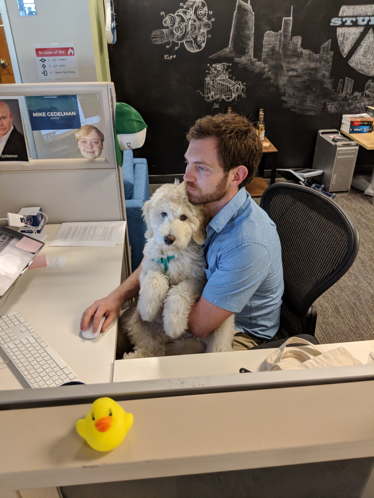

## Manager Readme Document for Reed Tomlinson

### About This Document
This is a README document for Reed Tomlinson, who was initialized in 1987 and is currently in public beta at V0.8.2. The idea behind this document is that managers, like good software, should come with proper documentation. Think of this as a User Guide for working with, and debugging, me.

### Background
I have always loved software. Like many developers from privileged backgrounds, I grew up with computers in my house and ready access to resources for learning and exploring the internet and the world of software development. Now I strive to understand what makes great software, and to help others become great at what they do.

My first experience of real leadership was in the US Forest Service. I spent four seasons fighting forest fires across the western US as part of a Hotshot Crew, and my experiences in that time laid a foundation for my management philosophy. I learned what pulls teams together after months of uninterrupted time together and what makes for good leadership under pressure. So when things are on fire (literally or figuratively) you might find that I'm the calmest person in the room. (My wife has learned that the calmer I am, the worse things must be.)

I've worked in startups for almost ten years now, and in that time I've built teams and products that I'm very proud of. These met with varying degrees of commercial success, but the teams I've built and been a part of are something that I will always stand by and count as my greatest achievements.

### Philosophy
I have a very strong growth mindset for myself and those who work for me. Being a mentor is the greatest joy in my professional life. As a result my management philosophy is similar to Reid Hoffman's "Tour of Duty." When we start working together, I will do my best to understand your career and personal goals and how we can shape your work to help you grow in that direction.

I strive to work in companies where I am not the best developer. If I am the best in the building, we're all in trouble. And it means that I'm not learning or growing by being challenged. My role is not to be the best developer, but to understand how the best developers operate and to empower them and help them grow.

I believe in the intrinsic and pressing need for diversity and inclusion in the workplace. I grew up priviliged in a number of ways (straight, white, cis-gender male), as did many in this industry. But we cannot let the historical composition of our industry become a confirmation bias about who is qualified or successful here.

### Standard Operating Procedure
#### One-on-Ones
I will try to keep these conversations high-level. If we get into the minutiae of a technical problem you're working on, I've goofed and we should course correct. I will always present praise ***and*** actionable critiques, no matter how well you're doing, so that we have an open dialogoue and won't shy away from hard conversations when they're needed. I will expect you to do the same.

#### OKRs
In the past I have tracked my own OKRs, even when this is not a standard practice organization-wide. I will always make my goals known to my team members and supervisors to keep me accountable and to make it clear what my leadership intent is.

#### Scheduling
My calendar may not be public but my availability will be. The best way to get dedicated time with me outside of our one-on-ones is the put 15-30 minutes on my calendar. If we need more time and my calendar is full, breakfast or lunch (in-person or on video) is always an option.

#### Open Door
My door is always open, even if it's closed. As a manager, you are my highest priority. If you need to talk, come find me. But if I have a door and it's physically closed or if I'm wearing headphones, message me to schedule a time to talk (unless the issue is pressing).

### Open Issues
I can be conflict avoidant, but am working on being more proactive and direct when issues first arise.

I love my work and take it very seriously. This has led me to overwork in the past and to take things too personally.

### Personal
If you need to distract me for an hour (perhaps you're performing a heist or caper of some sort), ask me about the following:
- ***My garden.*** Did I go overboard this year? Certainly. But _how_ overboard?
- ***My small backyard orchard.*** How many jellies and jams have I made?
- ***Anything fermented*** (homebrewed beer, kombucha, kimchi, etc). What have I brewed/pickled lately?
- ***My dog, Ravioli.*** He _**is**_ the best boy, thank you for noticing!
- ***Space.*** What's my favorite space fact? Here are 10, you pick.

I look forward to meeting you!

